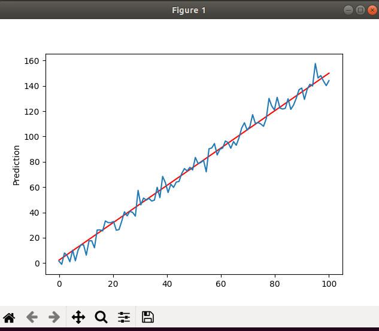
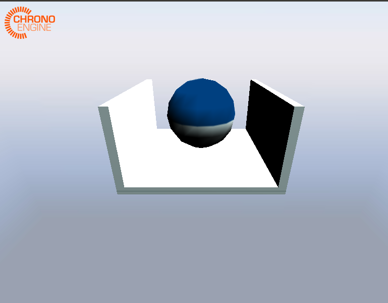
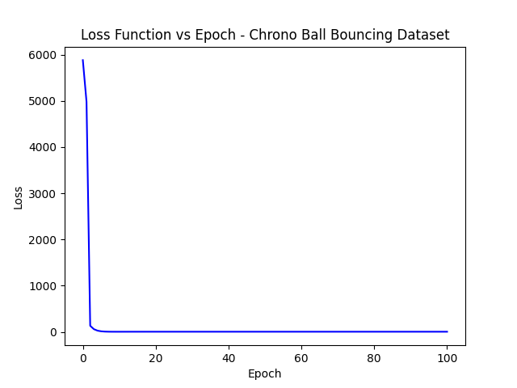

# Description
I set up project Chrono on my Linux machine and "sketched" out a solution to the problem. I wanted to write simpler versions of each part of the solution before refining any one of them. So, I took a simpler mechanical simulation in Chrono and learned how to gather data from it. I then took that data and used Tensorflow to build a neural network with it. The final big part of the solution would be building the Matlab API which can call my Python code. I didn't have time to try to have a Matlab function call my Python code. This is definitly possible. Next week    

# Tensorflow Choice
I could not figure out how to use the Keras API to compute arbitrary derivatives. I need this ability to compute arbitrary derivatives in order to have a model which not only predicts the 3-vector GRF butalso takes the learned mapping and can take derivatives with it. The Keras API is easy to use to build neural networks but is a very high level (and big) API. The lower level Tensorflow API allows you to define mathematical functions in a computational graph. The API then lets you compute derivatives numerically of any node in the graph. It is a little harder to use but this added flexibility is well worth the effort. If I used Keras, it is not clear how to compute the gradients we need. So, I used Tensorflow. 

# Tensorflow Primer
I have used Keras before to build neural networks but had not used Tensorflow. I spent some time working on getting up to speed on it. It is pretty awesome! I built a simple linear regression on an artificial dataset. The results are below. It builds the computational graph relating input data and their labels and then finds good weights to fit a line to the dataset via gradient descent

# Project Chrono Data 
I got Project Chrono installed and modified one of their demos (demo_IRR_ballSMC.cpp) to build a dataset. The demos has a big ball bounce in a container. I figured out how to access the ball's location at each time step and then wrote that data to a txt file.

# Simple Neural Network in Tensorflow
I built a simple neural network in Tensorflow. I then wrote code to parse the txt file of data describing where the ball's position over time. So, the input to the network is a 3-vector and the ouput is also a 3-vector. This should be an extremly easy function for the network to learn. I am trying to predict where the ball will be at the next time step, given where it currently is. The results are below

   

# Computing Arbitrary Derivatives
As stated above, it wasn't clear how to compute arbitrary derivatives in Keras. You could use their API to compute some derivatives very easily but the API seems to high level to specify an arbitrary derivative. It may be possible, but I couldn't find a simple, validated answer as to how to do this. I've always wanted to get more experience using Tensorflow anyways. I followed a few tutorials and experimented with the API in a file called (). TF should be able to compute any derivative we could ever want. 

# Questions
Ask Juntao about using Chrono granular. Could use examples of using Chrono granular if he has any. Also just need to read more of the API online. How best to set up the simulation of the hopping robot?

# Next Week
I want to set up a Matlab script that can call my Python code. I also want to dig deeper on the project Chrono API. There is a lot going on in Chrono! 

# Notes to Self
I spent time installing project Chrono on my Linux computer. Dan had a few extremly helpful pointers! There are a few steps in the Linux install which are tricky. I wrote a pdf supplementing how to install project Chrono on Linux. The file is titled NotesOnSettingUpAChronoProject.pdf
